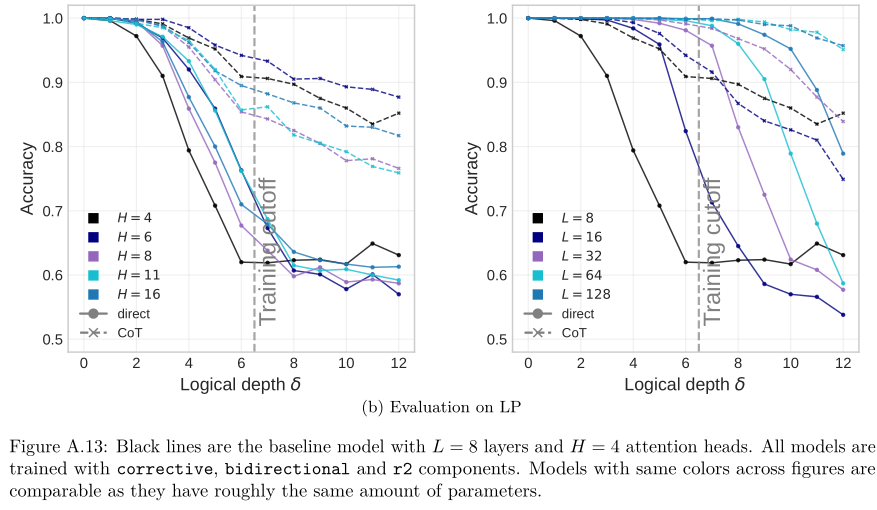
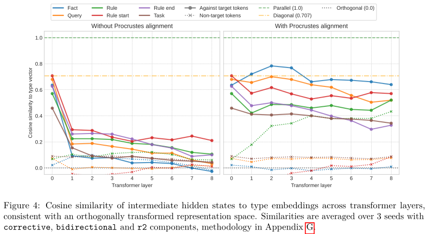
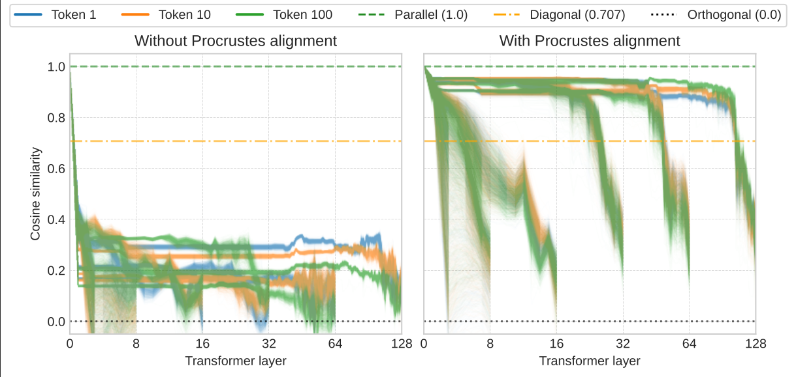

# The Scaling Properties of Implicit Deductive Reasoning in Transformers

Our contributions are as follows:
- We systematically mitigate shortcut-inducing biases, and improve out-of-distribution performance through the `r2` heuristic, bidirectional prefix masking, and a corrective objective.
- Within this setting, we find increasing model depth closes the implicit–explicit reasoning gap across graph topologies and problem widths, though CoT remains necessary for depth extrapolation.



- To advance mechanistic interpretability, we introduce a Procrustes alignment method that factors out orthogonal transformations across layers, revealing that linearly separable features remain topologically consistent and decodable throughout the network.





In appendix A,
we also connect the probed features to potentially learned strategies given the computational capacity of model and hardness of the algorithm.

If you find these findings useful, consider referencing this work :)

```bibtex
@article{vompa2026logic,
title={The Scaling Properties of Implicit Deductive Reasoning in Transformers},
author={Enrico Vompa and Tanel Tammet},
journal={Transactions on Machine Learning Research},
issn={2835-8856},
year={2026},
url={https://openreview.net/forum?id=M91oDrW4i7}}
```

## Config

`conf.py` contains `EXPERIMENTS_DIR` variable which should be set to the folder with the datasets and models

## Datasets

Shell files for dataset samplers are in `dataset` folder, which can be used for generating the base files.

The resulting files have also been uploaded to [huggingface](https://huggingface.co/datasets/p12315132/computational_limits_of_implicit_deductive_reasoning) for easy access.

Heuristic generation is a slow process, however. To speed up training, the pickled versions of datasets with the heuristics have been uploaded to [google drive](https://drive.google.com/drive/folders/1sO_BbtFW-zRH8nqtiOT5M7Ib08f8GW2w?usp=sharing).

The training code expects these files to be present inside `EXPERIMENTS_DIR + f"/datasets/predicate_logic/train/700k/eager_bulk_{train_distribution}_v2/"` if `pickled_dataset=True`

## Models

We selected the last epochs of the trained models for evaluation, and we made them available also through [google drive](https://drive.google.com/drive/folders/1sO_BbtFW-zRH8nqtiOT5M7Ib08f8GW2w?usp=sharing).

To reproduce all figures and tables in the paper, place the models inside `EXPERIMENTS_DIR + f"/models/type_llama_no_ffn/"`.

## Eval

To evaluate any model on any dataset, see `running_example.py` file

Figures are mainly created using `evaluation/investigate.py` file. 

Tables are mainly created using `evaluation/final_models.py` file.

Dataset specific content is generated using code in `dataset/inspect_correlations.py` and `dataset/rp_distribution.py` files.

By default, evaluation paths are commented out in code and to reproduce certain results, the path should be uncommented.

## Training

All the training is done through `training/train_predicate_transformer.py` file with configurations overridable with `--arg=value`.

Hello world run 
```shell
export PYTHONPATH=$PYTHONPATH:$(pwd)
python3 -u training/train_predicate_transformer.py --debug=True --train_distribution=rp --bidirectional_mask=True --batch_size=4 --corrective_cot=True
```

Shell scripts which were used for the training of all models are in `shell/` folder alongside pickled dataset generators and baseline evaluation triggers.

## Environment

All training and evaluation can be done on a single A100-80GB GPU.

Example SLURM setup:
```shell
#!/bin/bash

export PATH="$HOME/miniconda/bin:$PATH"
conda init bash
source ~/.bashrc
conda create --name py3_12_3 python=3.12.3
conda activate py3_12_3
python3 --version
pip3 install torch==2.9.0 transformers==4.57.1 dataclasses_json orjson matplotlib einx einops
pip3 list

export PYTHONUNBUFFERED=1
export PYTHONPATH=$PYTHONPATH:$(pwd)
cd ~/projects/computational_limits_of_implicit_deductive_reasoning

COMMAND=$(awk "NR==$SLURM_ARRAY_TASK_ID" part_6.txt)
echo "Running task $SLURM_ARRAY_TASK_ID: $COMMAND"
eval $COMMAND
```